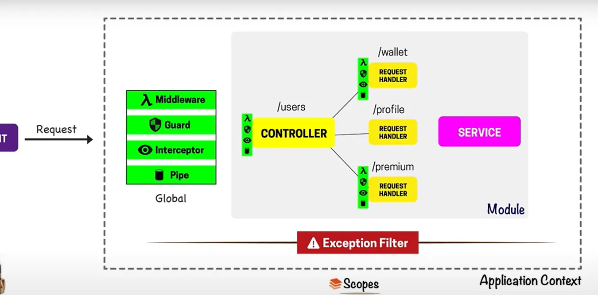
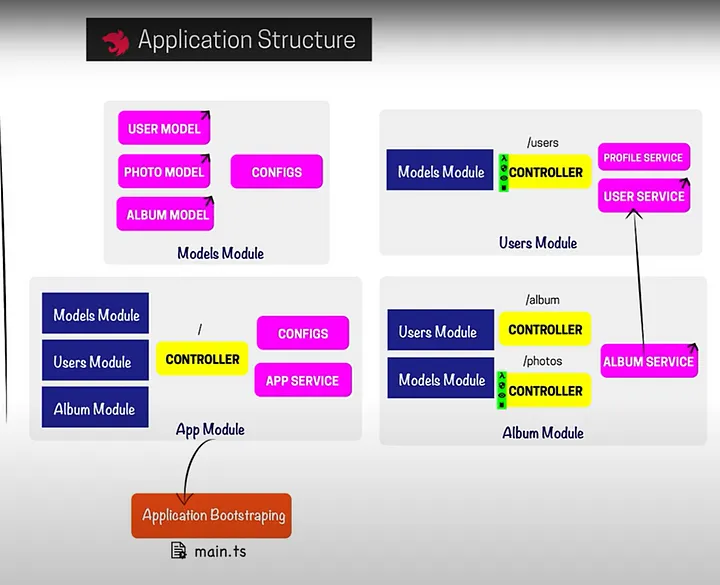

## What is NestJs

Nest is a framework for building efficient, scalable Node.js server-side applications. It uses modern JavaScript, is built with TypeScript (preserves compatibility with pure JavaScript) and combines elements of OOP (Object Oriented Programming), FP (Functional Programming), and FRP (Functional Reactive Programming).

Under the hood, Nest makes use of Express, but also provides compatibility with a wide range of other libraries, like Fastify, allowing for easy use of the myriad of third-party plugins which are available.


## Philosophy

In recent years, thanks to Node.js, JavaScript has become the “lingua franca” of the web for both front and backend applications, giving rise to awesome projects like Angular, React, and Vue, which improve developer productivity and enable the construction of fast, testable, and extensible frontend applications. However, on the server-side, while there are a lot of superb libraries, helpers, and tools for Node, none of them effectively solve the main problem - the architecture.

Nest aims to provide an application architecture out of the box which allows for effortless creation of highly testable, scalable, and loosely coupled and easily maintainable applications. The architecture is heavily inspired by Angular.

## NestJS VS NextJS

### Core Focus

--**NestJS**-- : Primarily a backend framework. It's designed for building scalable, maintainable, and testable server-side applications. Think of it as the foundation for your application's logic, APIs, and data handling.

--**NextJS**-- : Primarily a frontend framework built on top of React. It excels at creating user interfaces with features like server-side rendering (SSR), static site generation (SSG), and optimized performance. While it can handle some backend tasks with API routes, its main strength lies in the frontend experience.

### Architecture

--**NestJS**-- : Emphasizes a modular architecture with concepts like modules, controllers, and services. This promotes code organization, reusability, and maintainability, especially in large projects. It's heavily influenced by Angular's structure. 

--**NextJS**-- : Uses a file-system based routing system and focuses on component-based development with React. While it offers some structure, it's less opinionated than NestJS in terms of overall application architecture

### Can They Work Together

Absolutely! In many cases, the ideal solution is to use Next.js for the frontend and NestJS for the backend. This allows you to leverage the strengths of both frameworks:

- Next.js handles the user interface, routing, and frontend optimizations.   
- NestJS provides a robust and scalable backend for handling data, logic, and APIs.   

This combination is a popular choice for building modern, full-stack web applications.

## Principles of NestJS

### Modular Architecture

  

--**Modules**-- NestJS applications are organized into modules. Each module encapsulates related components, controllers, and services, promoting code organization and reusability.

--**Hierarchical Structure**-- Modules can be imported into other modules, creating a hierarchical structure that represents the application's features or domains.

### Dependency Injection (DI)

**Core Principle**: DI is a design pattern where dependencies (services, repositories, etc.) are provided to classes (controllers, services) instead of being created within the class itself.

**Benefits**:
- Improved testability: Dependencies can be easily mocked or stubbed during testing.
- Increased reusability: Services can be shared across multiple controllers or modules.
- Loose coupling: Classes are less dependent on specific implementations, making them more flexible and maintainable.

### Decorators

- **Metadata**: Decorators are a TypeScript feature that allows you to add metadata to classes, methods, properties, and parameters.
- **NestJS Usage**: NestJS heavily uses decorators to define routes (@Controller, @Get, @Post), inject dependencies (@Injectable), and configure modules (@Module).

### Controllers

- **Handling Requests**: Controllers are responsible for handling incoming requests and routing them to the appropriate handlers.
- **Request/Response Cycle**: They interact with services to process data and return responses to the client.

### Services

- **Business Logic**: Services encapsulate the application's business logic. They are responsible for data processing, validation, and interacting with other services or repositories.
- **Dependency Injection**: Services are often injected into controllers or other services, promoting code reusability and maintainability.

### Middleware

- **Request Pipeline**: Middleware functions are executed before a request reaches the controller.
- **Use Cases**: They can be used for tasks like logging, authentication, authorization, and error handling.

### Exception Filters

- **Centralized Error Handling**: Exception filters handle exceptions thrown during the request/response cycle.
- **Customization**: They allow you to define custom error responses and logging strategies.

### Pipes

- **Data Transformation**: Pipes transform data as it passes through the request/response cycle.
- **Use Cases**: They can be used for validation, data formatting, and transforming request payloads.

### Guards

- **Authorization**: Guards determine whether a user has access to a specific route or resource.
- **Authentication**: They can be used to authenticate users based on various strategies (e.g., JWT, OAuth).

### Interceptors

- **Request/Response Interception**: Interceptors intercept the request/response cycle, allowing you to modify the request or response.
- **Use Cases**: They can be used for tasks like logging, caching, and transforming responses.

### NestJS Request/Response Flow

Here's a simplified overview of how a request is handled in NestJS:

1. Request Received: The server receives an incoming request.
2. Middleware: Middleware functions are executed.
3. Routing: The request is routed to the appropriate controller based on the URL and HTTP method.
4. Guards: Guards are checked to ensure the user has access to the requested resource.
5. Pipes: Pipes transform the request payload.
6. Controller: The controller handler is executed, interacting with services to process the request.
7. Interceptors: Interceptors intercept the response.
8. Response Sent: The response is sent back to the client.
9. Exception Filters: If an exception occurs, it's caught by an exception filter.

  

NestJS application structure

## How to build a web application with nestJS and Nextjs step by step

### Create a Next.js app

### Create a NestJS app

### NestJS (Backend) Development

1. **Define your data models (entities)**   
   
   Create TypeScript classes representing your data (e.g., user.entity.ts, product.entity.ts). These might use decorators from an ORM like TypeORM if you're using a database.

2. **Set up database connection (if needed)**  
   
   Install the necessary database driver (e.g., pg for PostgreSQL, mongoose for MongoDB) and configure the connection in a NestJS module (often app.module.ts or a dedicated database.module.ts).

3. **Create services**   
    
   These contain the business logic of your application.  They'll interact with your entities and database (e.g., user.service.ts, product.service.ts).
4. **Create controllers**   
   
   These handle incoming requests and call the appropriate services (e.g., user.controller.ts, product.controller.ts). Use decorators like @Controller, @Get, @Post, etc., to define routes.

5. **Implement API endpoints**     
   
   In your controllers, define the API endpoints that your Next.js frontend will consume.  These endpoints will call the services to perform actions and return data.

```JavaScript
//Example (NestJS - user.service.ts)
import { Injectable } from '@nestjs/common';
import { InjectRepository } from '@nestjs/typeorm';
import { Repository } from 'typeorm';
import { User } from './user.entity';

@Injectable()
export class UserService {
  constructor(
    @InjectRepository(User)
    private usersRepository: Repository<User>,
  ) {}

  async findAll(): Promise<User[]> {
    return this.usersRepository.find();
  }

  async create(user: User): Promise<User> {
    return this.usersRepository.save(user);
  }
}

//Example (NestJS - user.controller.ts)
import { Controller, Get, Post, Body } from '@nestjs/common';
import { UserService } from './user.service';
import { User } from './user.entity';

@Controller('users')
export class UserController {
  constructor(private readonly userService: UserService) {}

  @Get()
  findAll(): Promise<User[]> {
    return this.userService.findAll();
  }

  @Post()
  create(@Body() user: User): Promise<User> {
    return this.userService.create(user);
  }
}
```

### Next.js (Frontend) Development

1. Fetch data from the NestJS API
2. Display data
3. Handle user interactions
4. Routing
5. State management (optional)

```JavaScript
//Example (Next.js - pages/index.js)
import { useState, useEffect } from 'react';

export default function Home() {
  const [users, setUsers] = useState([]);

  useEffect(() => {
    fetch('/api/users') // Proxying explained later
      .then(res => res.json())
      .then(data => setUsers(data));
  }, []);

  return (
    <ul>
      {users.map(user => (
        <li key={user.id}>{user.name}</li>
      ))}
    </ul>
  );
}

//Next.js next.config.js
module.exports = {
  async rewrites() {
    return [
      {
        source: '/api/:path*', // All requests to /api will be proxied
        destination: 'http://localhost:3001/:path*', // Your NestJS server URL
      },
    ];
  },
};
```

### Connecting Frontend and Backend

**Proxy**: The easiest way to connect your Next.js frontend to your NestJS backend during development is to use a proxy.  Configure Next.js to proxy API requests to your NestJS server.  This avoids CORS issues during development.

**CORS (For Production)**:  For production, you'll need to configure CORS (Cross-Origin Resource Sharing) on your NestJS server to allow requests from your Next.js frontend's domain.

### Building and Deployment

**Build**: Build your Next.js frontend (npm run build in the frontend directory) and your NestJS backend (npm run build in the backend directory).

**Deployment**: Deploy your Next.js frontend and your NestJS backend separately.  You can use platforms like Vercel, Netlify, AWS, Heroku, or others.  Make sure your Next.js frontend is configured to make API requests to the correct URL of your deployed NestJS backend.

## Cluster deployment

NestJS supports cluster deployment. Cluster deployment refers to the practice of running multiple instances of your application across several servers to improve availability, scalability, and performance.

NestJS can be deployed in a cluster using various methods, including:

- **PM2**: PM2 is a process manager for Node.js applications. It can be used to start, monitor, and manage your NestJS app. PM2 supports cluster mode, allowing you to deploy your application on multi-core CPUs for enhanced performance.
 
- **Docker**: Docker is a containerization platform that packages your application and its dependencies into a container, which can then be run on different servers. Docker supports Swarm mode for cluster management.
  
- **Kubernetes**: Kubernetes is a container orchestration platform that automates the deployment, scaling, and management of containerized applications.1 Kubernetes supports various cluster modes for deploying your application in a cluster.