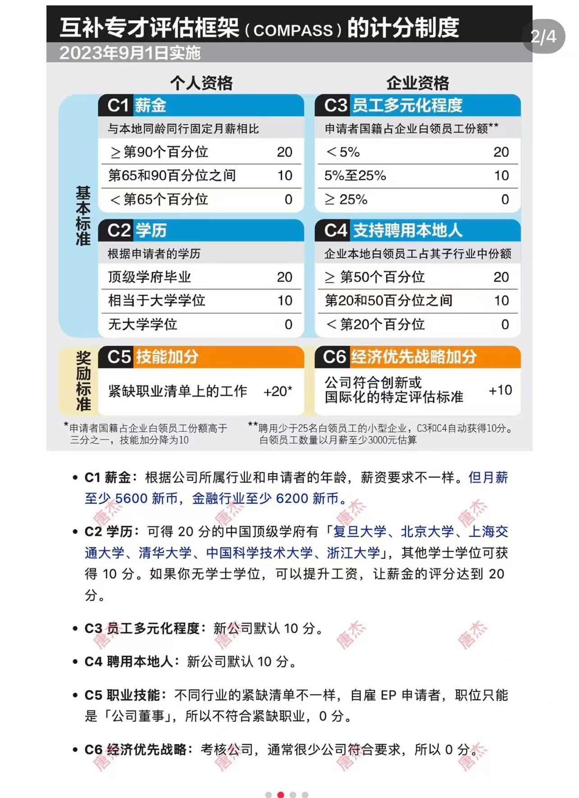

## EP

Employment Pass，申请就业准证。个人可以通过

- 找雇主获得EP
- 开公司自雇获得EP

二者没有高低区分之分，满足COMPASS评估系统==**40分**==，即可向人力部申请签发EP。

EP首次获得通常给==**2**==年，续签给==**3**==年。续签难度和首次获领难度相当，满足对应条件即可。

## COMPASS评估

  

### C1 薪金

根据AI统计的数据，新加坡it软件开发薪资水平大致为：

- 软件工程师： 月薪约 5,000 - 10,000 新元
- 前端开发工程师： 月薪约 4,500 - 8,000 新元
- 后端开发工程师： 月薪约 5,000 - 9,000 新元
- 全栈开发工程师： 月薪约 6,000 - 11,000 新元
- 移动应用开发工程师： 月薪约 5,500 - 10,000 新元
- 数据科学家： 月薪约 7,000 - 15,000 新元
- 人工智能工程师： 月薪约 8,000 - 20,000 新元

以前端为例，突破65%的比例线，需要月薪达到6775新元， **+10**

### 学历

大学学位 **+10**

### 技能加分

软件开发人员可加20分，但自雇EP职位只能是公司董事，所以不符合要求，**+0**

[参考来源](https://www.mom.gov.sg/passes-and-permits/employment-pass/eligibility/compass-c5-skills-bonus-shortage-occupation-list-sol)

### 企业资格

自雇类型，企业为创业公司，雇佣1名新加坡本地员工，C3&C4可加 **+20**

但公司成本会相应增加.

