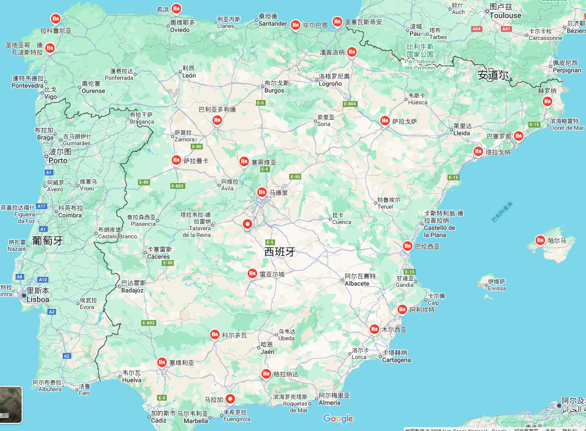

## 西班牙数字游民签证

西班牙于2023年正式推出数字游民签证（DNV），适用于非欧盟远程工作者和自由职业者。相比葡萄牙和意大利，西班牙的收入要求较低，且提供高达5年的长期居留，是欧洲最具吸引力的数字游民目的地之一.

## 条件

- 非欧盟公民，从事远程工作或自由职业。 
- 至少 **€2,560/月（约人民币20166元）**。
- 医疗保险（覆盖西班牙）。
- 无犯罪记录。
- 在西班牙租房或购房，需提供住所证明。
- 工作合同或业务证明
  - 1. [远程工作者](#remote)
  - 2. 或者自由职业者：需提供长期客户合同，证明有稳定收入

## 申请方式

- 西班牙境外使馆
- 境内使馆（旅游签转）

## 远程工作者{#remote}

1. 需为非西班牙公司远程工作
2. 需证明可通过互联网在西班牙完成工作，包括工作内容、流程、所需技术设备等
3. 国内社保证明
4. 银行对账单，至少近3个月，每月收入不低于2650欧元
5. 公司营业执照
6. 在职证明，证明至少3个月，且公司允许远程工作
7. 劳动合同
8. 本科及以上学位证书
9. 体检证明

## 税率

- 如果在西班牙居住超过184天后，工资收入需要纳税。前4年享受 15%个人所得税（代替普通税率24%）
- 5年后，税率恢复为普通税率（19%-47%）
 
**西班牙个人所得税（IRPF）累进税率**

| 年收入 (€)       | 税率  |
|----------------|------|
| 0 - 12,450    | 19%  |
| 12,451 - 20,200 | 24%  |
| 20,201 - 35,200 | 30%  |
| 35,201 - 60,000 | 37%  |
| 60,001 - 300,000 | 45%  |
| 300,000+      | 47%  |

## 携带家属

第一人每月收入要求增加75%，第二人开始每位增加25%。均以西班牙基本工资为参考，而不是主申请人实际收入。

即第一位家属大约**945**欧，后面每增加以为大约**315**欧。

主申请人+配偶+2个小孩+1个老人，月2650+945+315*3 = 4540 欧元。约人民币34600。

## 小孩上学

纯公立学校，全部以西班牙语教学。

- ✅ 持合法居留签证（数字游民签证可用）
- ✅ 在市政府注册住址（Empadronamiento）
- ✅ 孩子的出生证明+疫苗接种记录（部分学校要求）
- ✅ 在西班牙停留超过6个月（短期签证不行）

## 办理周期

据说很快，可能20天~3个月不等吧。

## 西班牙热门城市生活成本比较(2024)

以下是西班牙主要城市的**每月生活成本**对比，包括租房、饮食、交通等，单位为**欧元 (€)**。

### 🌍 1. 主要生活成本对比（单人 vs. 家庭）
| 城市          | 单人生活成本 | 家庭（四口之家） | 一居室租金（市中心） |
|--------------|------------|----------------|------------------|
| **马德里** 🇪🇸 | €1,800 - €2,500 | €3,500 - €5,000 | €1,200 - €1,800 |
| **巴塞罗那** 🇪🇸 | €1,700 - €2,400 | €3,400 - €4,800 | €1,100 - €1,700 |
| **瓦伦西亚** 🇪🇸 | €1,200 - €1,800 | €2,500 - €3,800 | €700 - €1,200 |
| **马拉加** 🇪🇸 | €1,300 - €2,000 | €2,700 - €4,000 | €800 - €1,300 |
| **塞维利亚** 🇪🇸 | €1,100 - €1,700 | €2,300 - €3,500 | €650 - €1,100 |

---

### 🏠 2. 租房成本（按房型）
| 城市          | 一居室（市中心） | 一居室（市郊） | 三居室（市中心） | 三居室（市郊） |
|--------------|----------------|----------------|----------------|----------------|
| **马德里** 🇪🇸 | €1,200 - €1,800 | €900 - €1,400  | €2,000 - €3,000 | €1,500 - €2,200 |
| **巴塞罗那** 🇪🇸 | €1,100 - €1,700 | €850 - €1,300  | €1,800 - €2,700 | €1,300 - €2,000 |
| **瓦伦西亚** 🇪🇸 | €700 - €1,200  | €550 - €900    | €1,200 - €1,800 | €900 - €1,400  |
| **马拉加** 🇪🇸 | €800 - €1,300  | €600 - €1,000  | €1,400 - €2,200 | €1,000 - €1,600 |
| **塞维利亚** 🇪🇸 | €650 - €1,100  | €500 - €850    | €1,100 - €1,700 | €800 - €1,300  |

---

### 🍽 3. 饮食成本（每月）
| 城市          | 外食（单人） | 超市购物（单人） | 外食（家庭） | 超市购物（家庭） |
|--------------|------------|----------------|------------|----------------|
| **马德里** 🇪🇸 | €250 - €500 | €200 - €350  | €600 - €1,200 | €500 - €800  |
| **巴塞罗那** 🇪🇸 | €250 - €500 | €200 - €350  | €600 - €1,100 | €500 - €800  |
| **瓦伦西亚** 🇪🇸 | €150 - €300 | €180 - €300  | €500 - €900  | €450 - €700  |
| **马拉加** 🇪🇸 | €180 - €350 | €180 - €300  | €500 - €900  | €450 - €700  |
| **塞维利亚** 🇪🇸 | €150 - €300 | €170 - €280  | €450 - €800  | €400 - €650  |

---

### 🚇 4. 交通成本
| 城市          | 月票（公共交通） | 加油费（每升） | 出租车（每公里） |
|--------------|----------------|--------------|----------------|
| **马德里** 🇪🇸 | €55 - €75  | €1.65 - €1.85 | €1.20 - €1.50 |
| **巴塞罗那** 🇪🇸 | €40 - €60  | €1.65 - €1.85 | €1.10 - €1.40 |
| **瓦伦西亚** 🇪🇸 | €35 - €50  | €1.60 - €1.80 | €1.00 - €1.30 |
| **马拉加** 🇪🇸 | €35 - €50  | €1.55 - €1.75 | €1.00 - €1.20 |
| **塞维利亚** 🇪🇸 | €30 - €45  | €1.50 - €1.70 | €0.90 - €1.10 |

---

### 🎯 5. 总结：哪个城市适合你？
| 城市          | 生活成本 | 适合人群 |
|--------------|----------|----------|
| **马德里** 🇪🇸 | 高 | 适合高收入人士、国际化工作者 |
| **巴塞罗那** 🇪🇸 | 高 | 适合创业者、科技行业人士 |
| **瓦伦西亚** 🇪🇸 | 中等 | 适合远程工作者、预算有限的家庭 |
| **马拉加** 🇪🇸 | 中等 | 适合退休人士、喜欢海滩生活的人 |
| **塞维利亚** 🇪🇸 | 低 | 适合预算有限的数字游民、文化爱好者 |

📢 **结论**：
- 如果你**预算充足**，喜欢国际化氛围：**马德里、巴塞罗那** 是最佳选择。
- 如果你**预算适中**，喜欢温暖气候和性价比高的生活：**瓦伦西亚、马拉加** 更适合。
- 如果你**预算有限**，希望生活成本低：**塞维利亚** 是不错的选择。

  
