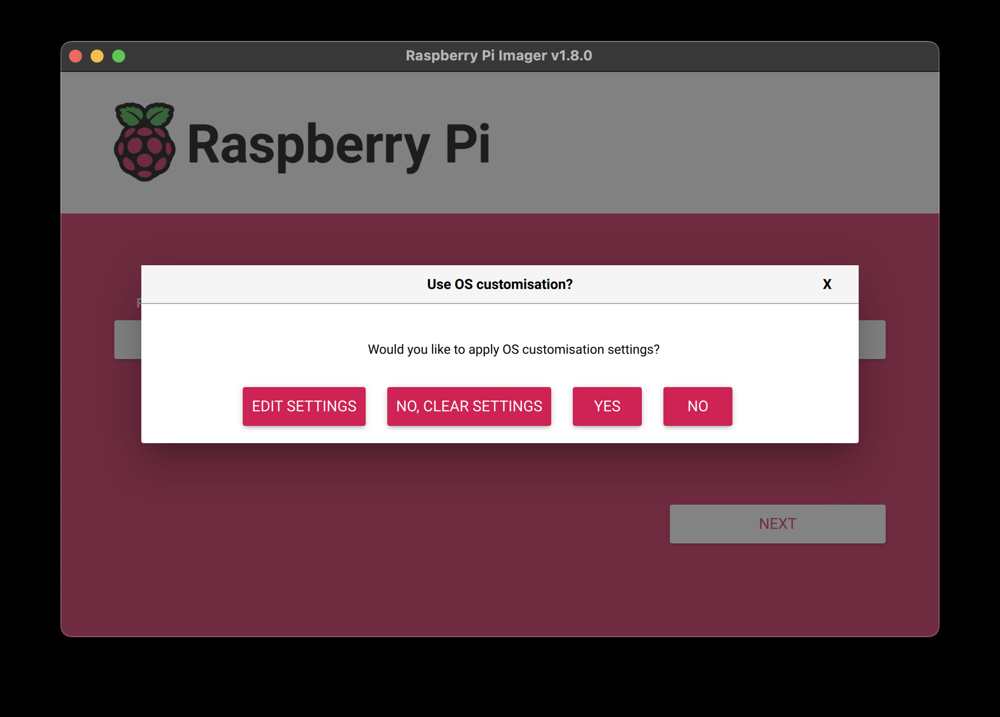

## 系统安装

### 准备一张SD卡

至少32G以上吧，留足空间。

### 下载镜像

在官方网站上[下载](https://pidoc.cn/downloads/operating-systems/#raspberry-pi-desktop)合适你的系统镜像，并准备写入SD卡（树莓派的启动盘）

### 烧录系统

在[这里](https://pidoc.cn/downloads/)下载烧录工具。工具安装在window或者macOS系统上（取决于你下载的版本），运行烧录工具，将系统镜像写入SD卡

::: note
在烧录的第一步，可以进入EDIT SETTINGS设置基本的系统信息，比如用户名、密码，Wifi连接，ssh等。

  
:::

### 启动系统

烧录完毕后，取出SD卡插入树莓派主板，上电启动。安装完毕。


## 安装node环境

ssh远程连接到树莓派设备后，执行命令

```shell
sudo apt-get install nodejs
```
国内网络，下载非常慢！！！而且安装node版本还不是最新版本！！！


## 安装docker

参数这个[链接](https://pidoc.cn/docs/pidoc/install_docker)安装docker，并配置国内加速镜像。

### 安装最新版node

参考nodejs官网[链接](https://nodejs.org/en/download)安装docker版本。

### 使用

```shell
docker run -it --rm --entrypoint sh -v /home/pi/Works:/works -p 2025:2025 node:22-alpine  
```

参数解释
- -i  保持容器的标准输入流打开，方便交互操作。
- -t  分配一个伪终端，让你可以在终端中与容器交互。

两个参数合在一起，即进入容器的交互模式。  

- --rm  容器在停止运行后会自动删除（防止产生临时的垃圾容器）。
- --entrypoint sh   将默认的 ENTRYPOINT（通常是运行 Node.js 程序）覆盖为 sh，也就是说容器启动时会直接进入 /bin/sh，而不是运行 Node 的默认程序。
- -v  /宿主目录路径:/容器内路径。挂载是双向的，容器内的更改会同步到宿主机上，宿主机上的更改会实时反映在容器内。
- -p  宿主机端口:容器端口

## 绑定静态IP

### 获取配置信息

包括现用的IP、网关、DNS信息等。

```shell
ip  a  #获取IP

ip route | grep default  #网关、以及IP
##输出：default via 192.168.2.1 dev eth0 proto dhcp src 192.168.2.103 metric 100

grep nameserver /etc/resolv.conf  #获取DNS信息
##nameserver 192.168.2.1
##nameserver fe80::5%eth0

```

### 设置静态IP

运行如下命令，进入终端设置界面

```shell
sudo nmtui
```

修改完成后，进入终端重启设置

```shell
sudo reboot
```

## 防火墙

```shell
sudo apt-get install ufw  #安装
sudo ufw status   #状态
sudo ufw enable   #开启
sudo ufw allow 2025  #放行2025端口
sudo ufw reload   #重启防火墙
```

## 安装X2Ray

* 在[网站](https://github.com/xtls/Xray-core/releases)下载对应的软件包，Raspberry设备使用命令查看设备特征
  
```shell
uname -m   #输出aarch64，因此应该下载Linux-arm64的版本
```
* 下载后解压，安装测试
```shell
sudo mv xray /usr/local/bin/    #执行文件拷贝至命令路径

sudo mv geosite.dat geoip.dat  /usr/local/bin/   #将屏蔽广告或处理特定域名的流量规则的配置拷贝至命令路径下

sudo nano /etc/xray/config.json   #创建配置文件，如果有现成的直接拷贝至该路径

sudo ufw allow 10808/tcp   #放行配置里涉及的端口

sudo xray -config /etc/xray/config.json  #启动应用

curl --proxy socks5h://127.0.0.1:30188 https://www.google.com  #测试验证是否工作正常，正常应该会返回html内容

```

* 设置开机启动

```ini
[Unit]
Description=Xray
After=network.target

[Service]
ExecStart=/usr/local/bin/xray -config /etc/xray/config.json
Restart=on-failure
User=root
LimitNOFILE=4096

[Install]
WantedBy=multi-user.target
```
创建如上文件后，执行如下命令

```shell
sudo systemctl enable xray   # 设置开机启动
sudo systemctl start xray  #手动启动应用
```

* 关于更新xray的以及如上安装包使用的信息，请[参考](https://xtls.github.io/document)


## 搭建WebDav服务

* 准备目录/docker/webdav
* 挂载外部磁盘，比如放置资料或者媒体文件的硬盘
```shell
  cd /mnt     #进入挂载目录
  sudo mkdir video  #创建挂载磁盘的目录
  sudo mount /dev/sda1 /mnt/video/  #挂载外部磁盘到video
```
* 在docker/webdav下创建配置文件
```yaml
# 监听任意网卡，多网卡可指定对应ip
address: 0.0.0.0
port: 8081
auth: true
prefix: /
modify: true
rules: []

# 跨域设置
cors:
  enabled: true
  credentials: true
  allowed_headers:
    - Depth
  allowed_hosts:
    - http://localhost:8081
  allowed_methods:
    - GET
  exposed_headers:
    - Content-Length
    - Content-Range

# 用户信息，如果 auth 为 true 生效
users:
  - username: pi
    password: xkjfdsafkkl  #输入登录密码
    # 配置自己的 webdav 访问范围，此例为 /data 内所有文件
    scope: /mnt/video
```

* 拉取docker容器
```shell
docker run -d --name webdav-go -v /mnt/video:/data/media -v /docker/webdav:/config -p 8081:8081 --restart unless-stopped hacdias/webdav:latest --config /config/config.yaml
```

* 拉取完成后，执行命令查看启动状态
```shell
docker ps -a   
```

* 正常的话局域网内通过Raspberry IP加端口，在浏览器上访问会弹出浏览器登录窗口
* 配置nginx反向代理
  ```nginx
  server {
      listen 6688 ssl;
      server_name abcd.com;  #替换为你的域名

      ssl_certificate /etc/nginx/ssl/certificate.crt;
      ssl_certificate_key /etc/nginx/ssl/private.pem;

      location / {
          # First attempt to serve request as file, then
          # as directory, then fall back to displaying a 404.
          proxy_pass http://localhost:8081;
          proxy_set_header Host $host;
          proxy_set_header X-Real-IP $remote_addr;
          proxy_set_header X-Forwarded-For $proxy_add_x_forwarded_for;
          proxy_set_header X-Forwarded-Proto $scheme;

      }
  }
  ```
  重启nginx
  ```shell
  sudo systemctl reload nginx
  ```
* 正常，此时通过域名+端口在浏览器里访问，也将弹出浏览器级别的登录窗口
